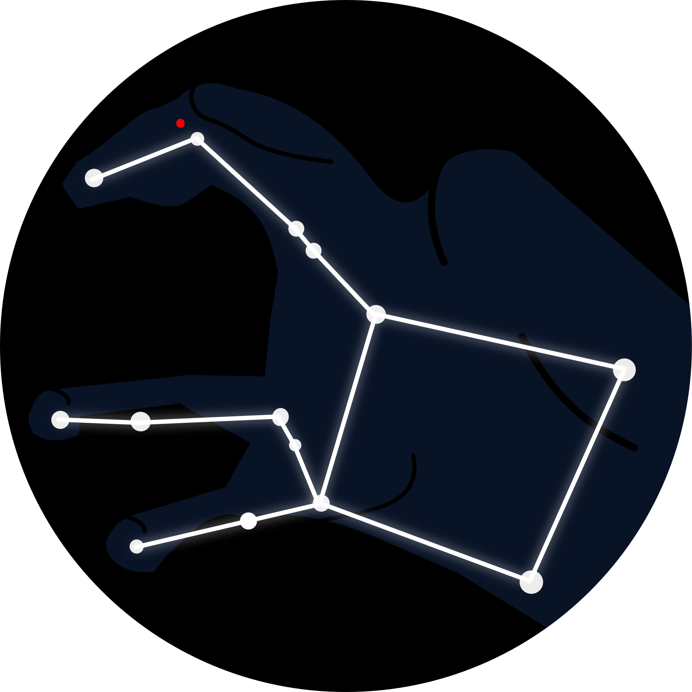

# Pegasus Server

## What is Pegasus?
Pegasus is a server management app. It's developed with NodeJS and VueJS and based on a "plugin" system. Each plugin provides a functionality to the app, for example:

- Display server ressources (RAM, CPU, Disk, Network, etc)
- Journalize HTTP requests per host
- Manage virtuals hosts
- Manage Game servers (Minecraft, Trackmania, etc)
- ...

## How it is organized
Pegasus is divided into three parts: 

- The server (NodeJS, Express, etc)
- The client (VueJS)
- The plugins 

WIP
